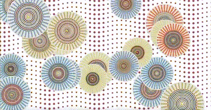
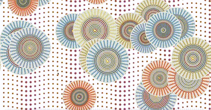

# cxue0850_9103_tut1_GroupA

## Major Project Description
### Group work:
#### For this creative coding project, our team chose ‘Wheel of Fortune’ by Pacita Abad.Pacita Abad used the stippling technique in this piece of artwork, which is a subtle blend of colours, patterns and textures, with a circular wheel as the main element, suggesting the themes of luck, destiny and the cycle of life.

#### We do this by constructing core elements consisting of inner concentric circles and outer dots. At the same time, we combined the Dunhuang colour scheme to adjust the colours, consider a reasonable structure, and reduce the proportion of the elements. In the end, we created a more elegant work that is as close to the original as possible.

### Individual work:

#### For the personal design part, I chose the method Perlin noise and randomness to develop my own variation.
- This approach not only increases the dynamics of the visuals, but also enhances the interactivity of the image. perlin noise is used to generate more natural and continuous visuals, through which each circle is generated and dynamically changed in a unique way, symbolising the different stages in the cycle of life - growth, decay and rebirth.
- In addition, I added the moon motif in the centre of the circle because Dunhuang murals are the jewels of ancient Chinese art, and many of them depict the moon. The moon in these murals is usually associated with religious stories or myths, demonstrating the holiness and mystery of the moon.

- This change not only enriches the visual hierarchy, but also adds a mystical and poetic atmosphere. The moon, as an important symbol in nature, further emphasises the theme of the cycle of life and the flow of time. It makes the moon not only a bright light in the night sky, but also an important symbol of culture and heritage.
- For the background modification, I was inspired by the assignment in week 10 and changed the continuous waves to a discrete form. This design symbolises that history is a slow fluctuation driven by time, emphasising the enjoyment of every moment of the present.
- At the same time, when the user clicks the mouse, the appearance of new circles increases the interactivity of the image, enabling the viewer to directly participate in the changes of the artwork, reflecting the continuous progress and transformation of life and history.

#### Code Description
- Inserting images and dynamically updating positions:
  - The `myImage` variable was added and an image called Moon.png was loaded via the `preload()` function. This change allows each `MultiCircle` centre to display an image, adding visual hierarchy. In addition, an `update()` method has been added that uses Perlin noise to dynamically update the position and size of the `MultiCircle`. These changes make the movement of each circle look more natural and smooth.
  
-